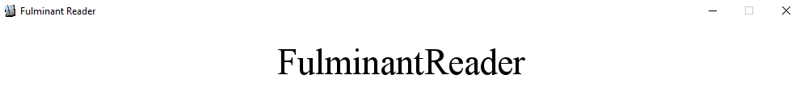

# FulminantReader 📖

FulminantReader is a simple program that allows you to read any text as fast as possible. Simple desktop analog for [ZapReader], write in Python 3.7 via PyGame.


## How to use
Add your text to **text.txt** file.

Run program with
```sh
$ pip install requirements.txt
$ python main.py
```
**ESC** - close application.

**SPACE** - pause application. 

Also, you can change settings in **constants.py** file. 
## Documentation history
* v0.1: 2018-23-12, first draft

[ZapReader]: <http://zapreader.com/>